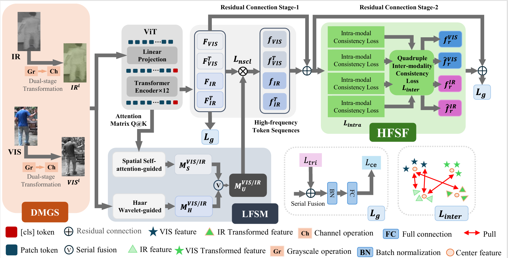
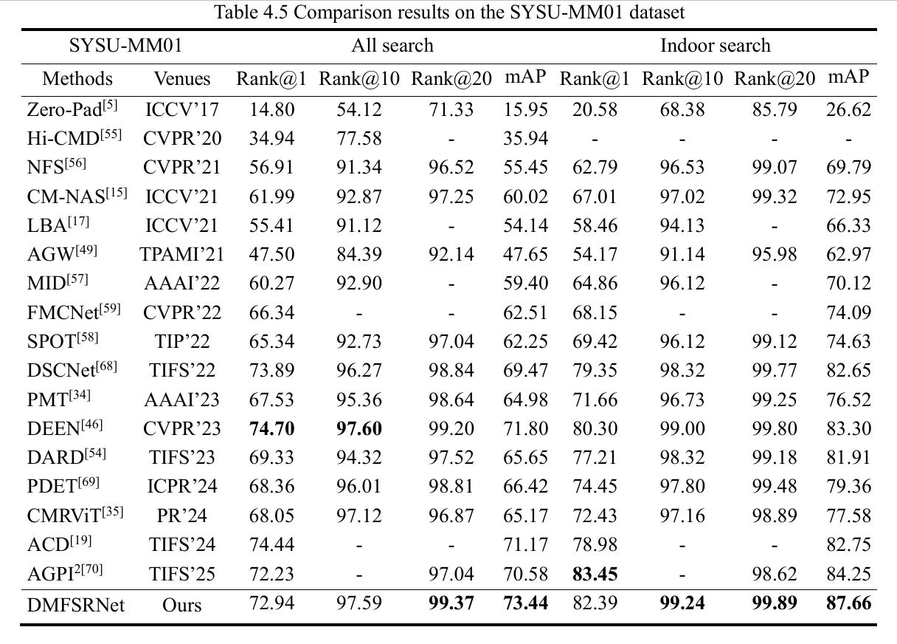
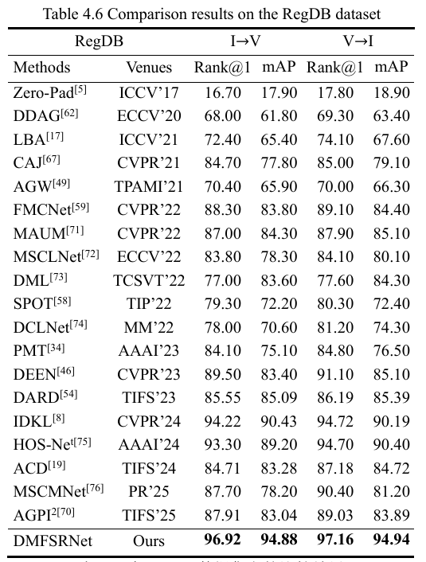
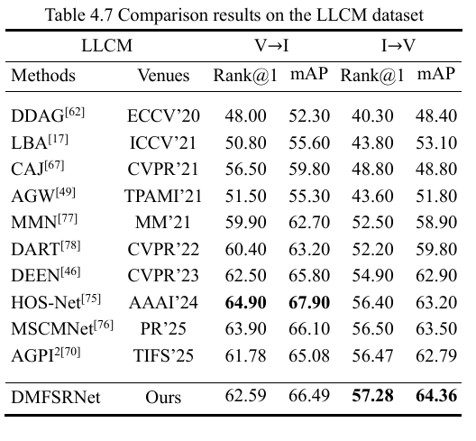

# DMSFNet
   
Pytorch code for paper "**DMSFNet: Dual-stage Modality-guided Frequency Suppression and Semantic Fusion for Visible-Infrared Person Re-Identification**"

The complete code will be released only after we receive the official notice of acceptance.

**Visible-Infrared Person Re-identifification**

### 1. Results
We adopt the Transformer-based ViT-Base/16 and CNN-based AGW [3] as backbone respectively.

|Datasets    | Backbone | mAP |  mINP |   Rank@1  |  Model|
| --------   | -----    | -----  |  -----  | ----- |:----:|
| #SYSU-MM01 | ViT | ~ 73.44% | ~ 64.28% | ~72.94% | [GoogleDrive] (  https://drive.google.com/file/d/1lO8O22s7UE0X2Ro3gUvkqG4hC4VLuap1/view?usp=sharing  ) |
| #RegDB  | ViT | ~ 94.88% | --- | ~96.92% | [GoogleDrive]         (  https://drive.google.com/file/d/1S6_JYnWrRegiVI9fgoYU3Yvt483dlzZc/view?usp=sharing  ) |
| #LLCM  | ViT | ~ 66.49% | ---| 62.59% | [GoogleDrive]            (  https://drive.google.com/file/d/1xBCkWisT_u9a_q_7Jk-lH-OcHDbUNS0j/view?usp=sharing  ) |

**\*Both of these models may have some fluctuation due to random spliting. AGW\* means AGW uses random erasing.  The results might be better by finetuning the hyper-parameters.**

### 2. Datasets

- (1) RegDB [1]: The RegDB dataset can be downloaded from this [website](http://dm.dongguk.edu/link.html).

- (2) SYSU-MM01 [2]: The SYSU-MM01 dataset can be downloaded from this [website](http://isee.sysu.edu.cn/project/RGBIRReID.htm).
- (3) LLCM [3]: Please send a signed [dataset release agreement](https://github.com/ZYK100/LLCM/blob/main/LLCM%20Dataset%20Agreement/LLCM%20DATASET%20RELEASE%20AGREEMENT.pdf) copy to zhangyk@stu.xmu.edu.cn. If your application is passed, we will send the download link of the dataset.

### 3. Requirements

#### **Prepare Pre-trained Model**

- You may need to download the ImageNet pretrained transformer model [ViT-Base](https://github.com/rwightman/pytorch-image-models/releases/download/v0.1-vitjx/jx_vit_base_p16_224-80ecf9dd.pth).
https://drive.google.com/file/d/1S6_JYnWrRegiVI9fgoYU3Yvt483dlzZc/view?usp=sharing

#### Prepare Training Data
- You need to define the data path and pre-trained model path in `config.py`.
- You need to run `python process_sysu.py` to pepare the dataset, the training data will be stored in ".npy" format.


### 4. Training

**Train DFMCNet by**

```
python train.py --config_file config/SYSU.yml
or
python train.py --config_file config/RegDB.yml
or
python train.py --config_file config/LLCM.yml
```
  - `--config_file`:  the config file path.

### 5. Testing

**Test a model on SYSU-MM01 dataset by**

```
python test.py --dataset 'sysu' --mode 'all' --resume '../save_model/SYSU_best.pth' --gall_mode 'single' --gpu 0 --config_file config/SYSU.yml

```
  - `--dataset`: which dataset "sysu" or "regdb".
  - `--mode`: "all" or "indoor"  (only for sysu dataset).
  - `--gall_mode`: "single" or "multi" (only for sysu dataset).
  - `--resume`: the saved model path.
  - `--gpu`: which gpu to use.

**Test a model on LLCM dataset by**

```
python test.py --dataset 'llcm' --test_mode [2,1] --resume '../save_model/LLCM_best_trial_1.pth'  --gpu 0 --config_file config/LLCM.yml

```
  - `--dataset`: which dataset "sysu" or "regdb".
  - `--test_mode`: whether thermal to visible search  True([1,2]) or False ([2,1]).
  - `--resume`: the saved model path.
  - `--gpu`: which gpu to use.


**Test a model on RegDB dataset by**

```
python test.py --dataset 'regdb' --resume '../save_model/RegDB_best_trial_1.pth' --tvsearch 0 --trial 1 --gpu 0 --config_file config/RegDB.yml

```

  - `--trial`: testing trial should match the trained model  (only for regdb dataset).

  - `--tvsearch`:  whether thermal to visible search  True(1) or False(2).

### 6. Result tables



### 7. Citation

Most of the code of our backbone are borrowed from [PMT](https://github.com/hulu88/PMT).

Thanks a lot for the author's contribution.

Please cite the following paper in your publications if it is helpful:

```
@article{lu2022learning,
  title={Learning Progressive Modality-shared Transformers for Effective Visible-Infrared Person Re-identification},
  author={Lu, Hu and Zou, Xuezhang and Zhang, Pingping},
  journal={arXiv preprint arXiv:2212.00226},
  year={2022}
}

@inproceedings{he2021transreid,
  title={Transreid: Transformer-based object re-identification},
  author={He, Shuting and Luo, Hao and Wang, Pichao and Wang, Fan and Li, Hao and Jiang, Wei},
  booktitle={Proceedings of the IEEE/CVF international conference on computer vision},
  pages={15013--15022},
  year={2021}
}

```

###  8. References.

[1] D. T. Nguyen, H. G. Hong, K. W. Kim, and K. R. Park. Person recognition system based on a combination of body images from visible light and thermal cameras. Sensors, 17(3):605, 2017.

[2] A. Wu, W.-s. Zheng, H.-X. Yu, S. Gong, and J. Lai. Rgb-infrared crossmodality person re-identification. In IEEE International Conference on Computer Vision (ICCV), pages 5380–5389, 2017.

[3] . Zhang and H. Wang, Diverse embedding expansion network and low-light cross-modality benchmark for visible-infrared person re-identification,in Proceedings of the IEEE/CVF conference on computer
vision and pattern recognition. IEEE, 2023, pp. 2153–2162.
[4] He S, Luo H, Wang P, et al. Transreid: Transformer-based object re-identification[C]//Proceedings of the IEEE/CVF international conference on computer vision. 2021: 15013-15022.

**if you have any question please connnet 2315363110@wtu.edu.cn**
